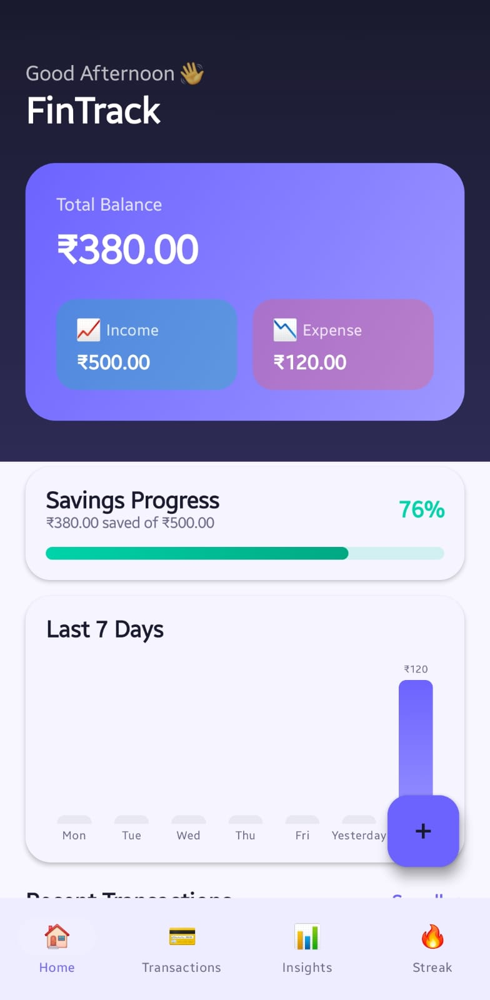
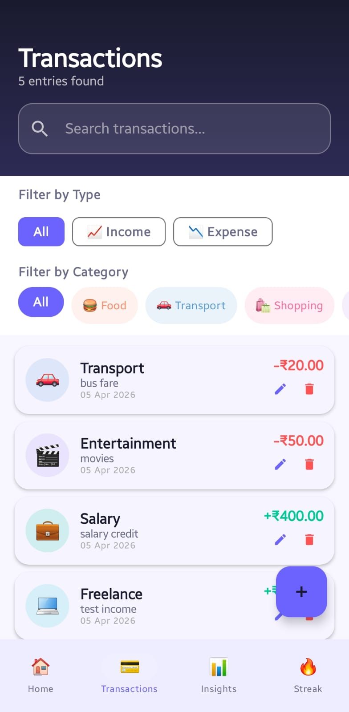
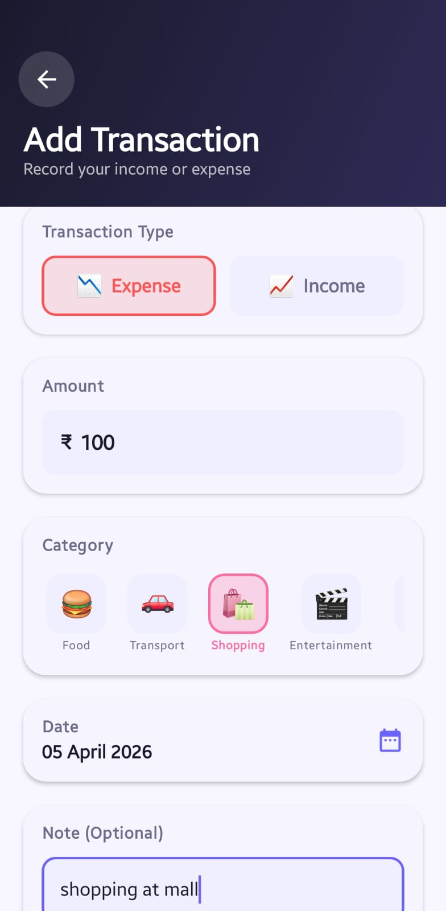
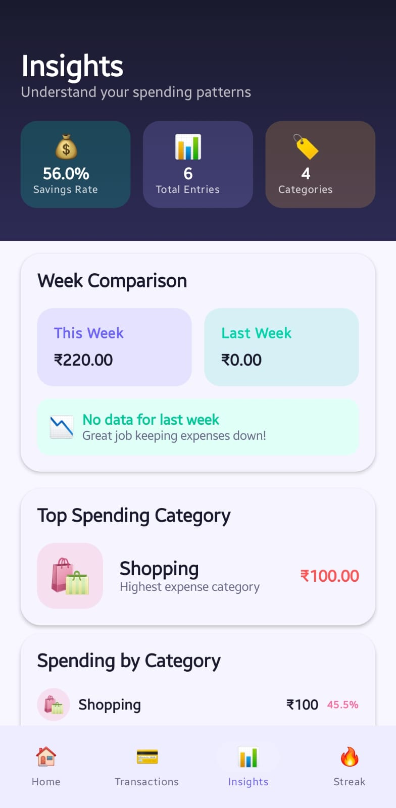
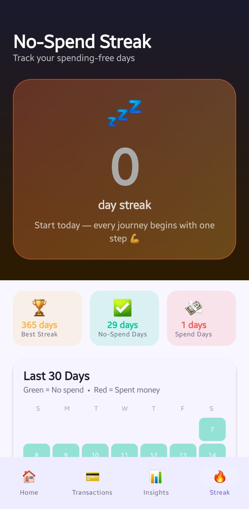

# FinTrack 💰

A personal finance companion app built with Kotlin and Jetpack Compose for Android.

FinTrack helps users understand their daily money habits in a simple and engaging way. It is not a banking app — it is a lightweight finance companion designed for regular everyday use.

---
## 🎬 Demo Video

[Watch the full demo here](https://www.youtube.com/watch?v=ehdN_8uv1iM)

## 📱 Screenshots

| Home | Transactions | Add Transaction |
|------|-------------|-----------------|
|  |  |  |

| Insights | Streak |
|----------|--------|
|  |  |

## ✨ Features

### 🏠 Home Dashboard
- Greeting based on time of day
- Total balance card with gradient design
- Income and expense summary
- Savings progress bar with percentage
- No-spend streak banner when active
- Last 7 days spending bar chart
- Recent 5 transactions with quick edit and delete

### 💳 Transaction Tracking
- Add, edit, and delete transactions
- Fields — amount, type, category, date, notes
- 12 categories with emoji icons (Food, Transport, Shopping, Entertainment, Health, Bills, Education, Salary, Freelance, Investment, Gift, Other)
- Search by category, note, or amount
- Filter by income or expense type
- Filter by specific category
- Confirmation dialog before deleting
- Empty states for no results

### 🔥 No-Spend Streak
- Tracks consecutive days without any expense
- Current streak counter with fire emojis
- Best streak ever recorded
- 30-day calendar heatmap — green for no-spend, red for spend days
- Motivational messages based on streak length
- 4 milestone badges — 3 day, 7 day, 14 day, 30 day
- How it works explanation section

### 📊 Insights
- Savings rate percentage
- This week vs last week expense comparison
- Top spending category
- Most frequently used category
- Spending breakdown by category with progress bars
- Income vs expense combined bar
- Monthly trend chart for last 6 months
- Circular savings rate indicator

---

## 🛠️ Tech Stack

| Layer | Technology |
|---|---|
| Language | Kotlin |
| UI Framework | Jetpack Compose |
| Architecture | MVVM |
| Database | Room (SQLite) |
| State Management | StateFlow + ViewModel |
| Navigation | Jetpack Navigation Compose |
| Design System | Material 3 |
| Minimum SDK | API 26 (Android 8.0) |
| Target SDK | API 35 |

---

## 🏗️ Project Architecture

The project follows MVVM architecture with a clean separation of layers:

app/
├── data/
│   ├── local/
│   │   ├── dao/             # Room database queries
│   │   ├── entity/          # Database table definitions
│   │   └── database/        # Room database instance
│   └── repository/          # Single source of truth
├── domain/
│   └── model/               # Clean app-level data models
├── ui/
│   ├── home/                # Home dashboard screen
│   ├── transactions/        # Transaction list and add/edit screens
│   ├── insights/            # Analytics and insights screen
│   ├── streak/              # No-spend streak screen
│   ├── components/          # Reusable composables
│   └── theme/               # Colors, typography, theme
├── viewmodel/               # All ViewModels with business logic
└── navigation/              # Navigation graph and routes

---

## 📐 Architecture Diagram

UI Screens
↕
ViewModels  (StateFlow, business logic)
↕
Repository  (single source of truth)
↕
Room DAO    (database queries)
↕
Room Database (SQLite)

---

## 🚀 Getting Started

### Prerequisites
- Android Studio Hedgehog or later
- JDK 11 or higher
- Android device or emulator running API 26+

### Setup Steps

1. Clone the repository
```bash
git clone https://github.com/arvindmishra07/fintrack-android.git
```

2. Open the project in Android Studio
3. Wait for Gradle sync to complete

4. Run the app
5. Select your device or emulator and the app will launch

---

## 📦 Dependencies
```kotlin
// Jetpack Compose BOM
androidx.compose:compose-bom:2024.02.00

// Core
androidx.core:core-ktx:1.12.0
androidx.lifecycle:lifecycle-runtime-ktx:2.7.0
androidx.activity:activity-compose:1.8.2

// Navigation
androidx.navigation:navigation-compose:2.7.7

// ViewModel
androidx.lifecycle:lifecycle-viewmodel-compose:2.7.0

// Room Database
androidx.room:room-runtime:2.6.1
androidx.room:room-ktx:2.6.1

// Charts
com.patrykandpatrick.vico:compose:1.13.1

// Coroutines
org.jetbrains.kotlinx:kotlinx-coroutines-android:1.7.3
```

---

## 💡 Design Decisions and Assumptions

### Design
- Bold and colorful Material 3 design system
- Purple as the primary brand color with teal and coral accents
- Each transaction category has its own unique color and emoji
- Dark gradient headers on all screens for visual hierarchy
- Cards with subtle elevation and rounded corners throughout

### Assumptions Made
- Currency is fixed to Indian Rupees (₹) as the target market
- A no-spend day is defined as any day with zero expense transactions logged
- If a user adds an expense for today their current streak resets immediately
- Categories are predefined — 8 expense categories and 4 income categories
- The app is single user with no authentication required
- Data is stored locally on device using Room database
- No internet connection is required

### State Management
- StateFlow is used for all UI state to ensure reactive updates
- ViewModel survives configuration changes like screen rotation
- Repository pattern ensures the UI never directly accesses the database
- combine() operator merges multiple flows for derived states like balance

---


## 👨‍💻 Author

Arvind Mishra

